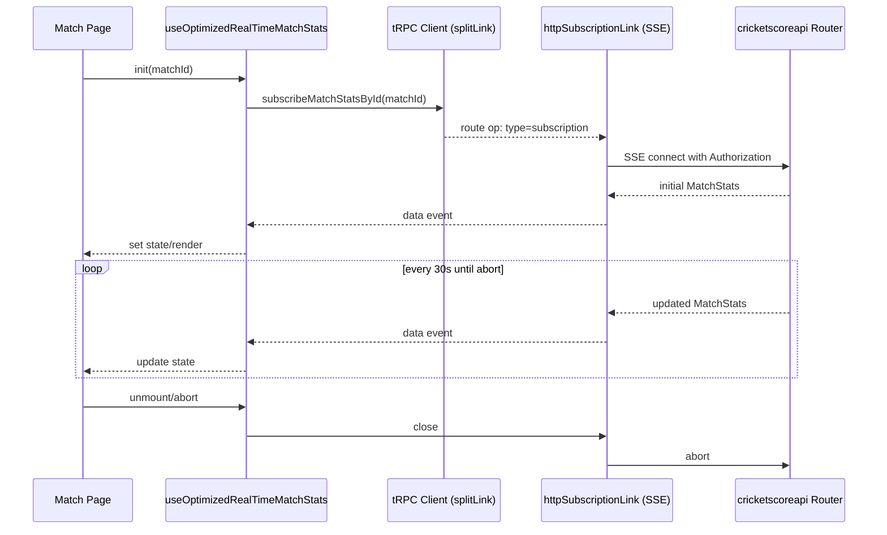

# 🏏 Cricket Score Monorepo

Welcome to the Cricket Score monorepo! This repository contains the frontend and backend for a real-time cricket score application.

## 🚀 Projects

This monorepo contains the following projects:

- **`apps/cricket-score-frontend`**: A [Next.js](https://nextjs.org/) frontend that displays live cricket scores and statistics. See the [frontend README](./apps/cricket-score-frontend/README.md) for more details.
- **`apps/cricketscoreapi`**: A [TypeScript](https://www.typescriptlang.org/) backend exposing a **tRPC API** (via Express) for cricket data. See the [backend README](./apps/cricketscoreapi/README.md) for more details.
- **`packages/shared-types`**: Shared TypeScript types consumed by both the backend and frontend.

## 🛠️ Technologies Used

This monorepo uses [pnpm](https://pnpm.io/) for workspace management.

### Frontend

- [Next.js](https://nextjs.org/)
- [React](https://reactjs.org/)
- [TypeScript](https://www.typescriptlang.org/)
- [Tailwind CSS](https://tailwindcss.com/)
- [Clerk](https://clerk.com/)

### Backend

- [TypeScript](https://www.typescriptlang.org/)
- [Express.js](https://expressjs.com/)
- [tRPC](https://trpc.io/)
- [Prisma](https://www.prisma.io/)
- [MongoDB](https://www.mongodb.com/)
- [Cheerio](https://cheerio.js.org/)
- [Docker](https://www.docker.com/)

## 🚀 Getting Started

To get started with this monorepo, you'll need to have [pnpm](https://pnpm.io/) installed. Then, you can install the dependencies from the root of the repository:

```bash
pnpm install
```

This will install the dependencies for all the projects in the monorepo.

### Running the projects

You can run the frontend and backend projects separately using the following commands:

```bash
# Run both frontend and backend (concurrently)
pnpm dev

# Or run them separately
pnpm frontend:dev
pnpm backend:dev
```

Ports:
- Frontend: `http://localhost:3000`
- Backend tRPC endpoint: `http://localhost:3001/trpc`

## 🔄 Real-time Flow (Sequence Diagram)



## 📜 License

Each project in this monorepo has its own license. Please refer to the `LICENSE.md` file in each project's directory for more information.